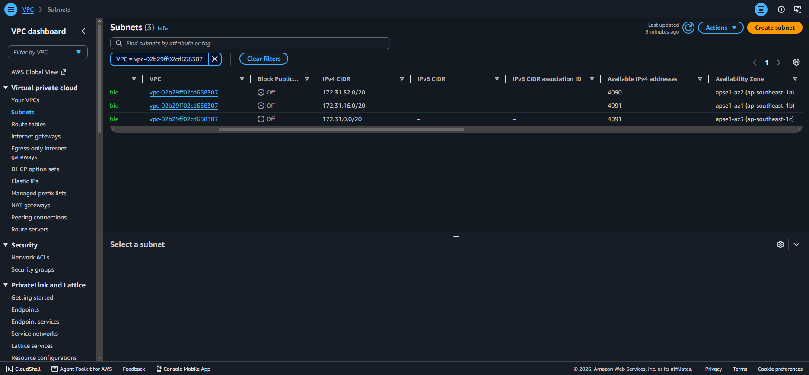
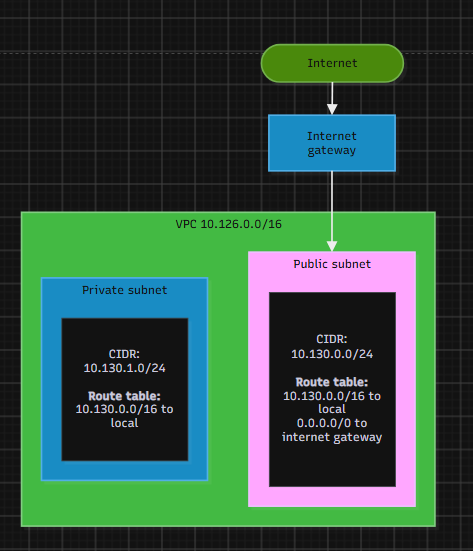

# Assignment 2 Submission

<!--
How to use this template:

1. Copy this file to submissions/assignment-2/<your-github-username>/submission.md
2. Replace every answer placeholder with your own answer. Delete the angle brackets too.
3. Save your four images in the same folder, with the exact file names below.
4. Do not write your full name or your student number in this file.
-->

## About me

- GitHub username: kadirisubs
- Section: IV-CCSAD
- IAM user name that I signed in with: ccsad-g06
- X: 130

---

## Part A. Explore

### A1. The VPC

Default VPC IPv4 CIDR:

172.31.0.0/16

Number of addresses in that CIDR:

65,536

### A2. The subnets

| Availability Zone | IPv4 CIDR |
| --- | --- |
| apse1-az2 (ap-southeast-1a) | 172.31.32.0/20 |
| apse1-az1 (ap-southeast-1b) | 172.31.16.0/20 |
| apse1-az3 (ap-southeast-1c) | 172.31.0.0/20 |

Screenshot 1. Save it as `screenshot-1-subnets.png` in your folder. The image line below shows it.

### A3. Available addresses

Available IPv4 addresses in each subnet:

| 172.31.32.0/20 | 4090
| 172.31.16.0/20 | 4091 
| 172.31.0.0/20 | 4091

Why is the number lower than 4,096?

AWS retains five IP addresses per subnet, specifically for the network address, VPC router, DNS service, future expansion, and network broadcast—reducing the total usable IPs from 4,096 to 4,091.

What uses the missing address in the subnet with the lowest number?

An EC2 instance (or an Elastic Network Interface / ENI).

### A4. The route table

| Destination | Target |
| --- | --- |
| 0.0.0.0/0 | igw-0943e7e6f88293168 |
| 172.31.0.0/16 | local |

Screenshot 2. Save it as `screenshot-2-routes.png` in your folder. The image line below shows it.

[Screenshot 2: routes of the route table](screenshot-2-routes.png)

### A5. Public or private

Are the default subnets public or private? Which route proves it?

Public. The inclusion of the default route 0.0.0.0/0 pointing to the Internet Gateway (igw-0943e7e6f88293168) confirms the subnet is public, as it enables direct inbound and outbound internet traffic routing.

### A6. The internet gateway

State of the internet gateway:

Attached

What happens to the default subnets if the gateway is detached?

Detaching the gateway leaves the 0.0.0.0/0 route without a valid target, cutting off public internet access for all subnets while maintaining internal communication through the 172.31.0.0/16 local route.

### A7. NAT gateways

Number of NAT gateways:

0

Can a server in a new private subnet download updates? Why?

Lacking both a route to an Internet Gateway and a NAT Gateway within the VPC, the private subnet leaves the server with no outbound internet access to retrieve software updates.

### A8. The network ACL

| Rule number | Source | Allow or Deny |
| --- | --- | --- |
| 100 | 0.0.0.0/0 | Allow |
| * |  0.0.0.0/0 | Deny |

How is a network ACL different from a security group?

A Network Access Control List operates at the subnet level as a stateless firewall processing numbered allow and deny rules, whereas a Security Group operates at the instance level as a stateful firewall evaluating only allow rules.

![Screenshot 3: inbound rules of the network ACL] 

### A9. The default security group

Inbound rule (type and source):

All traffic, from source default security group (self-referencing security group ID sg-...).

Which resources can send traffic to an instance that uses it?

Only resources (such as other EC2 instances) that are assigned the same default security group. All other traffic from external sources or other security groups is blocked.
0.0.0.0

---

## Part B. Prepare

### B1. Plan two subnets

- Public subnet CIDR: 10.130.0.0/24
- Private subnet CIDR: 10.130.1.0/24

### B2. Route tables

Route table of the public subnet:

| Destination | Target |
| --- | --- |
| 10.130.0.0/16 | local |
| 0.0.0.0/0 | internet gateway |

Route table of the private subnet:

| Destination | Target |
| --- | --- |
| 10.130.0.0/16 | local |

### B3. My VPC diagram

Tool used (Excalidraw, draw.io, Lucidchart, or paper):

https://app.diagrams.net

### B4. Predict a change

Can you still open the web page from your laptop? Why?

No. Removing the 0.0.0.0/0 route removes the path to the Internet Gateway, preventing external traffic from reaching the instance and preventing the instance from responding to the internet.

Can the instance still reach another instance in the VPC? Why?

Yes. The 10.130.0.0/16 (or 172.31.0.0/16 in the default VPC) local route remains active, allowing instances within the same VPC to communicate directly with each other.

### B5. Place a database

Which subnet gets the database? Why?

The private subnet. Databases store sensitive data and should not be exposed directly to the public internet. The private subnet has no route to an Internet Gateway, preventing external actors from initiating connections while still allowing local application servers in the public subnet to query the database via the local route.

### B6. My question about VPCs

What is your question, and what made you think of it?

Question: How does AWS handle IP address conflicts or routing if two different VPCs with identical CIDR blocks (e.g., both using 10.130.0.0/16) need to be connected via VPC Peering or a Transit Gateway?

What made me think of it: Reading about how many companies use the same private IP address ranges (like 10.0.0.0/8) inside their isolated VPCs without issue on the public internet, which made me wonder what happens when those isolated private networks eventually need to connect to each other internally.
